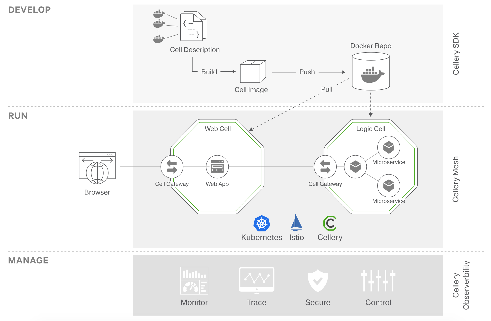
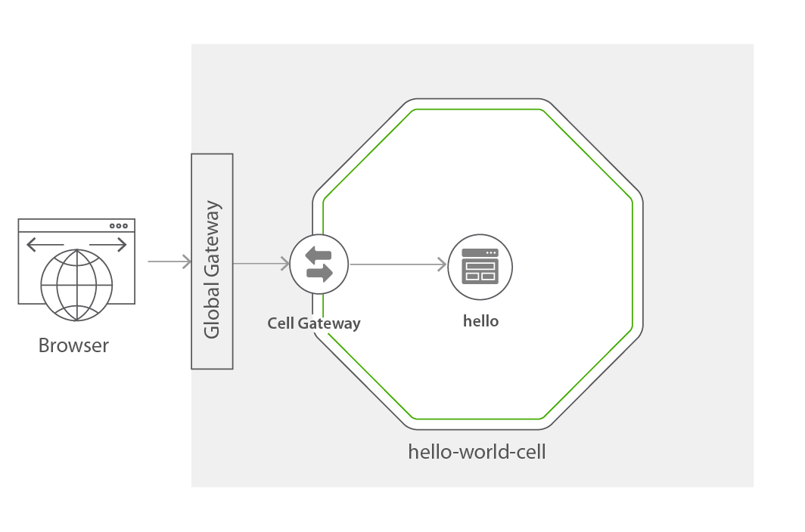

[](https://travis-ci.org/wso2-cellery/sdk)
[](https://codecov.io/gh/wso2-cellery/sdk)
[](https://github.com/wso2-cellery/sdk/releases)
[](https://github.com/wso2-cellery/sdk/releases)
[](https://github.com/wso2-cellery/sdk/commits/master)
[](https://opensource.org/licenses/Apache-2.0)


Build, run, and manage code-first composites on Kubernetes.

- For in-depth information about how to use Cellery, visit [https://wso2-cellery.github.io/](https://wso2-cellery.github.io/).                                 
- To ask questions and get assistance from our community, use [cellery dev mailing list](mailto:wso2-cellery-dev@googlegroups.com).
- To learn how to participate in our overall community, visit [our community page](docs/community.md).
- To explore already existing Cellery images, visit [cellery hub](https://hub.cellery.io/)

In this README:

- [Introduction](#introduction)
- [Why Cellery?](#why-cellery)
- [Quickstart guide](#quickstart-guide)
- [What's next?](#whats-next)

In addition, here are some other documents you may wish to read:
- [Cell Based Architecture](https://github.com/wso2/reference-architecture/blob/master/reference-architecture-cell-based.md) - explains the concepts of Cell based Architecture.
- [Cellery Architecture](docs/cellery-architecture.md) - explains the high-level architecture of Cellery.
- [How to code cells?](docs/cellery-syntax.md) - explains how Cellery cells are written.
- [CLI commands](docs/cli-reference.md) - reference for CLI commands.
- [Samples](https://github.com/wso2-cellery/samples) - a collection of useful samples.
- [Cellery community](docs/community.md) - describes how to get involved and contribute to the Cellery project.
- [Cellery roadmap](https://github.com/wso2-cellery/sdk/wiki) - provides the roadmap of the Cellery project.

## Introduction

Cellery is a code-first approach to building, integrating, running and managing composite 
microservice applications on Kubernetes. Build, push/pull, run, scale and observe composites. 
Create secure APIs by default, code components in any language.

---
## Why Cellery?

The use of microservices and/or serverless functions is exploding as organisations aim to get better
agility and speed of development. This quickly gets out of control, resulting in tens or hundreds 
of microservices in a highly connected network. There is a strong need for an approach that helps 
create higher-level constructs from multiple microservices and serverless functions. 
Cellery aims to create composites with well-defined boundaries that fit with CI/CD pipelines and 
modern development and DevOps practices. 
You can read more about this approach [here](https://wso2-cellery.github.io/philosophy)



Cellery provides a developer tooling, runtime and a management plane. This allows you to develop,
run and manage your composite microservice applications on Kubernetes. 

- **Cellery SDK**  

    The SDK allows developers to write, build, run & manage cells. 
    A cell description file is written using the [Ballerina](https://ballerina.io) programming language. 
    In a nutshell, this file declares the microservice components that have to be included in the cell,
    the relationship between those components, dependencies to other cells, and it also declares the API 
    that need to be exposed.
    
    A CLI is also part of this SDK, which allows you to build, run, test and manage your cells. 
    
- **Cellery Mesh**  

    The mesh provides the wiring & communications medium between cells. Components in a cell cannot invoke
    components in other cells directly. Only APIs exposed by the cells are invokable. These interactions are 
    strictly governed by security policies.

- **Cellery Management**  

    This consists of a management plane, which allows you to observe your cells in the runtime, as well 
    as other runtime aspects, and it also allows you to manage security and other policies.

---

## Quickstart Guide

The easiest way to setup Cellery is using the 'local' mode which installs a VirtualBox image. 
For other installation approaches including GCP and Docker for Desktop see [here](docs/installation-options.md)

### Prerequisites 
- [VirtualBox](https://www.virtualbox.org/wiki/Downloads) 

### Download Cellery
#### Linux
Download the [latest Cellery(.deb) installer](https://wso2-cellery.github.io/downloads) and install it using dpkg command as shown below.
```
dpkg -i cellery-ubuntu-x64-<version>.deb
```
#### Mac OS
Download [latest Cellery(.pkg) installer](https://wso2-cellery.github.io/downloads)  and install it by following macOS package installation steps.

### Setup Cellery runtime
Once Cellery has been installed, verify the installation is working by executing `cellery version`.

In this quickstart guide, we will install a basic local Cellery runtime by running the following 
command:

1. Run the local setup command. 

    ```
    cellery setup create local -y
    ```
    
    This may take a few minutes. If the setup was successful, you should see the following message:
    
    ```
    ✔ Runtime status (Cellery)...OK
    ```
    
2. Once the setup completes, run the following command to check the status:

    ```
    cellery list instances
    ```  
    
    You shouldn't see any errors. 
    
Now that we have installed Cellery let's validate that it is running using a simple cell.

### Hello world with Cellery

Let's quickly run a sample hello world cell as shown in the diagram below.  

 

The `hello-world-cell` contains one component `hello`. The `hello` component is defined by a container image which 
is written in Node.js and it is a simple webapp. In the quick start we will be deploying the `hello-world-cell`.

Now let's look at the steps required to run this cell. 

1. Execute the `cellery run` command that will download the hello-world cell from the `wso2cellery` 
    organization in [docker hub](https://hub.docker.com/u/wso2cellery) and run the cell.
    
    ```
    $ cellery run wso2cellery/hello-world-cell:latest -n hello-world-cell -y
    ```
    
    You should see the following output:
    
    ```
    ✔ Connecting to registry-1.docker.io
    ✔ Fetching metadata
    ✔ Pulling image wso2cellery/hello-world-cell:latest
    ✔ Saving new Image to the Local Repository
    
    Image Digest : sha256:2d5659e5787df7e7ae0f58671c0b9d857b5a19e5fbdb02fccbc98a64016a97f6
    
    ✔ Extracting Cell Image wso2cellery/hello-world-cell:latest
    
    Main Instance: hello
    
    ✔ Reading Cell Image wso2cellery/hello-world-cell:latest
    ✔ Validating dependencies
    
    Instances to be Used:
    
      INSTANCE NAME                            CELL IMAGE             USED INSTANCE   SHARED
     ------------------------- ------------------------------------- --------------- --------
      hello-world-cell           wso2cellery/hello-world-cell:latest   To be Created    -
    
    Dependency Tree to be Used:
    
     No Dependencies
    
    ✔ Starting main instance hello-world-cell
    ✔ Successfully deployed cell image: wso2cellery/hello-world-cell:latest
    
    What's next?
    --------------------------------------------------------
    Execute the following command to list running cells:
      $ cellery list instances
    --------------------------------------------------------
    ```
    
    Please allow a few minutes for completion.
    
2. Execute `cellery list instances` to check the status of your cell. 

    ```
    $ cellery list instances
             INSTANCE        CELL IMAGE                           STATUS        GATEWAY               COMPONENTS          AGE
     ---------------------- ------------------------------------ -------- -------------------------- ------------ -----------------------
      hello-world            wso2cellery/hello-world-cell:latest   Ready    hello--gateway-service        1          30 minutes 48 seconds
    ```

3.  Add the following line to the /etc/hosts file.
    
    ```
      192.168.56.10 hello-world.com
    ```

4. Now browse to [http://hello-world.com/](http://hello-world.com/) and you should see the web page.

    Congratulations! You have successfully got your first cell running!
    
5. Finally, terminate the cell instance that you started using the `cellery terminate` command.

    ```
    $ cellery terminate hello-world-cell
    ```
---
    
## What's next?
* [Installation Options](docs/installation-options.md) - lists all installation options with Cellery.
* [Samples](https://github.com/wso2-cellery/samples/tree/master) - a collection of useful samples.
* [CLI commands](docs/cli-reference.md) - reference for CLI commands.

Learn about full lifecycle of cells in Cellery from,
* [Developing and runing a Cell](docs/writing-a-cell.md) - step by step explanation on how you could define your own cells.
* [Testing a Cell](docs/cell-testing.md) - provides the instructions to run test against cells.
* [Managing a Cell](docs/cell-management.md) - lists the management aspects of cells in the runtime.
    * [Patch](docs/cell-patch-and-adv-deployment.md) - patch a running cell instance.
    * [Scale up/down](docs/cell-scaling.md) - scalability of running cell instances with zero scaling and horizontal autoscaler.
    * [Observability](docs/cellery-observability.md) - provides the runtime insight of cells and components.


