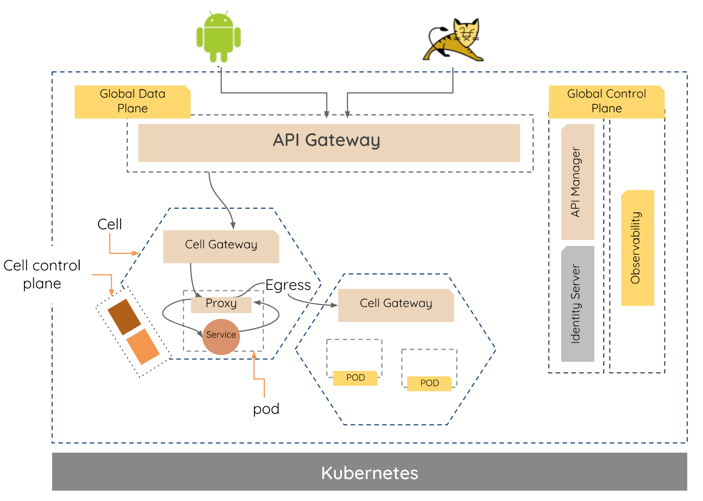

# Cellery
The future is evolving to a modern day mainframe: a single virtual computer that runs everything for an organization. 
Middleware no longer runs as a separate centralized system but has become distributed and virtualized. 
Applications are no longer standalone monolithic systems but distributed across different boundaries, lifecycles and networks. 
We call these composite applications. 

The [cell-based architecture](https://github.com/wso2/reference-architecture/blob/master/reference-architecture-cell-based.md) is 
an opinionated approach to building composite applications. A key aim of this work is to enable **agility** for composite, 
cell-based architectures. There are many complexities in development, deployment, lifecycle management and operations of 
composite, integration-first applications on a distributed compute platform.

Integration at scale involves:
- Effective handling of tens of thousands of networks connections, including load-balancing, circuit-breaking and failover.
- Inherent federated, adaptive and distributed security.
- Dynamic discovery, versioning and management of both remote and local endpoints (API management “everywhere”)
Equal support for pull, push, events and streaming.

DevOps for composite applications:
- Versioning of apps
- Different strategies for rolling out & rolling back versions of apps
- Observability of the entire deployment
- Support for GitOps

Cellery is a specification that defines how a cell can be developed, deployed, and managed, therefore it is optimised 
for agile development, deployment and operations of cell-based integration applications, running at scale. 

Cellery Mesh is the runtime implementation of the cellery specification that allows the cells to be deployed and managed. 

The current implementation of Cellery uses Ballerina, the cloud native integration language to define Cells, components 
and the interaction between those. 


## High Level Architecture of Cellery Mesh



### Cell
A cell is an immutable application component that can be built, deployed and managed as a complete unit. 
The cell consists of multiple services, managed APIs, ingress and egress policies (including routing, throttling, 
access control), security trust domain, deployment policies, rolling update policies and external dependencies. 
The cell definition captures all of these in a standard technology-neutral fashion. The detailed specification of the cell definition can be found here.

### Data Plane 
Data plane includes the pods, sidecars, services, etc that participate in dispatching the requests to cells, and the 
components within the cell. This includes global gateway, cell gateway, and cell egress.

#### Global Data Plane (Gateway)
APIs to be exposed to the external world from Cellery Mesh will be published to the global gateway. When a Cell 
descriptor is being written, it should mention which APIs to expose on the Cell Gateway and which should be exposed on 
the Global data plane. 

#### Cell Gateway (Cell Ingress)
Ingress into the cell will be via the cell gateway only. The cell APIs are deployed on the cell gateway. When defining 
a cell, the cell APIs to be published to the cell gateway can be defined.

#### Cell Egress
Inter-cell & intra-cell calls will go through the side car deployed along with each micro services within the cell which is 
the Envoy proxy.

### Cell Control Plane
The cell control plane, controls the intra-cell communications. This consists of Cell STS services 
as mentioned below.

#### Cell Secure Token Service 
As each cell is considered as a separate trust domain, each cell has a secure token service which is used to exchange 
tokens in order to securely communicate by workloads. Each STS has its own configurations which decides the behaviour of 
token issuance and validations. Furthermore, each cell STS has an Open Policy Agent instance which is used to enforce 
fine grained access control. Cell deployers can enforce authorization policies for inter cell communication as 
well as intra cell communications. The detailed information about the security of Cellery can be found in 
[mesh-security](https://github.com/cellery-io/mesh-security)..

### Global Control Plane
Global control plane controls the request flow from external systems, and also provide overall control of cells globally, 
and inter-cell communication. API Manager, Observability, and Security are the core components of the global control 
plane as explained below. 
 
#### API Manager
The Global Control Plane will have API Management capabilities in the form of API Publishing (mostly via APIs), and API 
Discovery (Store). Cell definition includes description of an API (endpoint) and specify whether the API needs to be 
deployed in the global gateway or cell gateway or both. Based on the cell definition, the API will be published to 
Global API Manager. 

#### API Discovery
External API consumers and Internal API consumers (cell, internal app developers) will use the API Store in the Global 
Control Plane to discover available APIs and their documentation. 

#### Observability
Cellery observability is enabled by default. Observability Global Control plane will consist WSO2 Stream processor as 
the core observability engine. The envoy proxies, and API gateways, will push the metrics and traces related information 
to the Observability control plane, to process, analyze and visualize the data. Also this layer can be used to provide 
the runtime governance of the system. 

#### Security
APIs exposed through global gateway can be secured with OAuth and other state of the art authentication mechanisms. 
Not only authentication, but all functionalities and extension points provided through API manager can be used to 
authenticate and authorize API requests. 

Within Cellery, each cell is considered as a unique trust domain and each of these cells have its own Secure Token 
Service (STS) which the workloads use to communicate in a trusted manner with each other. Not only authentication, but 
also fine grained authorization requirements are also  can be achieved for inter and intra cell communications. Cellery 
uses Open Policy Agent to enforce fine grained access control within cell and inter cells. 

All these operations and checks are enforced through sidecars which are running along side workloads. Considering 
security aspects of a service and passing user context or information will be out of component developers tasks and 
will be managed by Cellery within the mesh.  Refer [mesh-security](https://github.com/cellery-io/mesh-security). for more information on Cellery Security and how to 
enforce policies. The detailed information about the security of Cellery can be found [mesh-security](https://github.com/cellery-io/mesh-security).


## Getting Started
### Pre requisites 

### How to Install

#### Linux

#### Mac OS

### Set up Cellery Runtime
Once the cellery is installed, the users can install the cellery mesh runtime locally on your machine as an Virtual 
Machine or in GCP. The steps to setup cellery runtime is provided below.  

1. As a first step, user has to execute `cellery setup` command to configure Cellery runtime. This 
will prompt a list of selections. There are three options to select from; create, manage and switch. By selecting 
`create ` section users can setup the Cellery runtime. 
```
$ cellery setup
[Use arrow keys]
? Setup Cellery runtime
    Manage
  ➤ Create
    Switch
    EXIT
```

2. When `create` is selected 2 options will be prompted; `Local` and `GCP`.
cellery setup. You can select either options based on your installation requirement.
```
$ ✔ Create
[Use arrow keys]
? Select an environment to be installed
  ➤ Local
    GCP
    BACK
```

#### Local Setup
As mentioned in setup guide above, select Local to setup the local environment. 
This will download and install a pre-configured cellery runtime. Once the installation process is completed, 
users can start working on a cellery project.

#### GCP
First users will have to create a GCP project. Then run `cellery setup` command and select `create` then `GCP` from the 
menu as mentioned in the 3rd step at Setup Runtime.
```
cellery setup
$ ✔ Create
[Use arrow keys]
? Select an environment to be installed
    Local
  ➤ GCP
    BACK
```

This will start the process of creating a Cellery runtime in GCP.
```
✔ Creating GKE client
✔ Creating GCP cluster
⠸ Updating kube config clusterFetching cluster endpoint and auth data.
⠼ Updating kube config clusterkubeconfig entry generated for cellery-cluster520.
✔ Updating kube config cluster
✔ Creating sql instance
✔ Creating gcp bucket
✔ Uploading init.sql file to dcp bucket
✔ Updating bucket permission
✔ Importing sql script
✔ Updating sql instance
✔ Creating NFS server
✔ Deploying Cellery runtime

✔ Successfully installed Cellery runtime.

What's next ?
======================
To create your first project, execute the command:
  $ cellery init
```
When the process is completed Cellery will point to the newly created GCP cluster and user can start working on a 
Cellery project. 

### Build and Deploy your first Cell 
Now we can deploy a hello world cell as a the first project. Follow the instructions listed below to deploy the hello world cell.

1. Execute cellery init command from the command prompt, and provide the project name as ‘helloworld’. 
```
$ cellery init
? Project name:  [my-project] helloworld


✔ Initialized project in directory: /Users/sinthu/wso2/sources/dev/git/mesh-observability/docker/helloworld

What's next?
--------------------------------------------------------
Execute the following command to build the image:
  $ cellery build helloworld/helloworld.bal -t [repo/]organization/image_name:version
--------------------------------------------------------
```
2. The above step will auto generate a cellery file in the location: helloworld/helloworld.bal with below content. 
As you can see there is one component defined in the cell as ‘helloWorldComp’, and has defined one ingress with context 
path ‘hello’. Therefore the hello API can be invoked within the cellery runtime by other cells. Further within the build 
method of the cell file, the hello ingress is also exposed as global API therefore the same API can be accessed external 
of cellery runtime. 

```ballerina
import ballerina/io;
import celleryio/cellery;

cellery:Component helloWorldComp = {
    name: "hello-world",
    source: {
        image: "sumedhassk/hello-world:1.0.0"
    },
    ingresses: {
        hello: new cellery:HTTPIngress(
                   9090,

                   "hello",
                   [
                       {
                           path: "/*",
                           method: "GET"
                       }
                   ]

        )
    }
};

public cellery:CellImage helloCell = new();

public function build(string orgName, string imageName, string imageVersion) {
    helloCell.addComponent(helloWorldComp);

    helloCell.exposeGlobalAPI(helloWorldComp);

    var out = cellery:createImage(helloCell, orgName, imageName, imageVersion);
    if (out is boolean) {
        io:println("Hello World Cell Built successfully.");
    }
}
```

3. Build the cellery image for hello world project by executing the cellery build command as shown below.
```
$ cellery build helloworld.bal -t myorg/helloworld:1.0.0
Hello World Cell Built successfully.

✔ Building image myorg/helloworld:1.0.0
✔ Saving new Image to the Local Repository


✔ Successfully built cell image: myorg/helloworld:1.0.0

What's next?
--------------------------------------------------------
Execute the following command to run the image:
  $ cellery run myorg/helloworld:1.0.0
--------------------------------------------------------
```

4. Run the built cellery image with ‘cellery run’ command. 
```
$ cellery run myorg/helloworld:1.0.0
Running cell image: myorg/helloworld:1.0.0
cell.mesh.cellery.io/helloworld created


✔ Successfully deployed cell image: myorg/helloworld:1.0.0

What's next?
--------------------------------------------------------
Execute the following command to list running cells:
  $ cellery ps
--------------------------------------------------------
```

5. Now the hello world cell is deployed, you can run the cellery ps command to see the status of the deployed cell. 
Wait until the cell becomes into ‘Ready’ state.
```
$ cellery ps
NAME         STATUS     GATEWAY                       SERVICES   AGE
helloworld   Ready   helloworld--gateway-service   1          3m
```

6. Login to API Manager’s store application with below details.
```
URL: https://wso2-apim/store/
Username: admin
Password: admin
```

7. Click on the API with name ‘helloworld_global_1_0_0_hello - 1.0.0’ which the global API published by the hello world 
cell that you deployed.The subscribe and generate the token as described in WSO2 APIM documentation.  

8. Now you can invoke the API externally from your machine as shown below. The <access_token> is the token that you 
generated in step - 7, and replace your taken instead of <access_token>. The context of the API can be derived from 
the API that was published in the API Manager, and the ‘sayHello’ is the resource that was implemented in the actual 
hello world service.
```
$ curl https://wso2-apim-gateway/helloworld/hello/sayHello -H "Authorization: Bearer <access_token>" -k
Hello, World!
```

## Samples
### HR Application
Employee Portal sample demonstrates an application which uses the cell-based architecture. This application contains 
four microservices deployed across three different cells based on their responsibilities, as explained below.

**HR Cell**  
- Contains one microservice written in ballerina.
- This microservice invokes Employee cell and Stock cell to build the employee information and returns the result.
- Exposes an API at the global Gateway which can be consumed by any API consumer from outside Cellery.

**Employee cell**  
- Contains two microservices (employee and salary) written in ballerina.
- Employee microservice returns employee details such as name, designation.
- Salary microservice returns employee salary details.
- Exposes a cell level API, when invoked returns the aggregated response from employee and salary response.

**Stock cell**  
- Contains one microservice written in ballerina.
- This microservice returns the stock related data for the employee.
- Exposes a cell level API, when invoked returns the response from stock microservice.

The detailed steps to run this sample is available (samples/employee-portal)[https://github.com/cellery-io/sdk/tree/master/samples/employee-portal].

### Product Review Application
A multi-cell application which demonstrates multiple protocol support. (See)[https://github.com/cellery-io/sdk/tree/master/samples/product-review] here for more information.

### Auto Scaling
This is a single cell application which demonstrates the autoscaling of cell components. 
While Cellery is capable of using CPU, memory usage, etc. to autoscale cell components, 
this sample focuses on the former and hence is written to artificially hog cpu for demonstration purposes. 
(See)[https://github.com/cellery-io/sdk/tree/master/samples/pet-service]

## Cellery Commands
### Init
Initializes a cellery project.  
Usage : `cellery init`  
In the command prompt, provide the project name.

### Build
Build an immutable cell image with required dependencies.  
Usage : `cellery build <BAL_FILE_NAME> -t <ORGANIZATION_NAME>/<IMAGE_NAME>:<VERSION>`  
Example : `cellery build my-project.bal -t wso2/my-cell:1.0.0`

### Run
Use a cellery image to create a  running instance.  
Usage : `cellery run <ORGANIZATION_NAME>/<IMAGE_NAME>:<VERSION>`  
Example : `cellery run wso2/my-cell:1.0.0`

### Ps
List all running cells.  
Usage : `cellery ps`

### Push
Push cell image to the remote repository.  
Usage : `cellery push <ORGANIZATION_NAME>/<IMAGE_NAME>:<VERSION>`  
Example : `cellery push wso2/my-cell:1.0.0`

### Pull 
Pulls cell image from the remote repository.  
Usage : `cellery pull <ORGANIZATION_NAME>/<IMAGE_NAME>:<VERSION>`  
Example : `cellery pull wso2/my-cell:1.0.0`

### Images
List cell images that was pulled and built in the current machine.  
Usage : `cellery images`

### Stop
Stop a running cell instance.  
Usage : `cellery stop <CELL_NAME>`  
Example : `cellery stop hello-cell`

### Status 
Performs a health check of a cell.  
Usage : `cellery status <CELL_NAME>`  
Example : `cellery status hello-cell`

### Apis 
List the exposed APIs of a cell instance.  
Usage : `cellery apis <CELL_NAME>`  
Example : `cellery apis hello-cell`

### Logs 
Displays logs for either the cell instance, or a component of a running cell instance.  
Usage : `cellery logs <CELL_NAME> / cellery logs <CELL_NAME> -c <COMPONENT_NAME>`  
Example: `cellery logs hello-cell / cellery logs hello-cell -c my-component`

### Components
Lists the components which the cell encapsulates.  
Usage : `cellery components <CELL_NAME>`  
Example : `cellery components hello-cell`

### List-files
List the files (directory structure) of a cell images.  
Usage : `cellery list-files <ORGANIZATION_NAME>/<IMAGE_NAME>:<VERSION>`  
Example : `cellery list-files wso2/my-cell:1.0.0`

### Extract-resources
Extract the resource files of a pulled image to the provided location. This is useful when cells are packaged with 
swagger files, therefore any components or micro services that uses the cell can generate the code from the swagger.  
Usage : `cellery extract-resources <ORGANIZATION_NAME>/<IMAGE_NAME>:<VERSION> ./resources`  
Example : `cellery extract-resources cellery-samples/employee:1.0.0 ./resources`

## Contribute to Cellery
The Cellery Team is pleased to welcome all contributors willing to join with us in our journey. 
Cellery project is divided into few repositories as explained below. 
(cellery-io/sdk)[https://github.com/cellery-io/sdk/] : This repository contains the cellery specification implementation, 
cli implementation, and installers for different operating systems.  
(cellery-io/distribution)[https://github.com/cellery-io/distribution/]: This repository contains kubernetes artifacts 
for cellery mesh runtime, and docker image generation for Global and cell API Manager.   
(cellery-io/mesh-controller)[https://github.com/cellery-io/mesh-controller/] : This repository includes the controller 
for cell CRD in kubernetes.  
(cellery-io/mesh-security)[https://github.com/cellery-io/mesh-security]: This includes cell based control plane 
components such as STS, and other related security functionality for overall cellery mesh.  
(cellery-io/mesh-observability)[https://github.com/cellery-io/mesh-observability]: This repository includes the 
observability related components such as WSO2 stream processor extensions, siddhi applications for tracing, telemetry 
processing, dependency model generation, observability portal, etc, and docker images for observability control plane.  

### Build from Source
#### Prerequisites 
JDK 1.8 
Ballerina 0.990.3 
Go 1.11.2 or higher
Apache Maven 3.5.2 or higher
Git
#### Steps
1. Clone the repository to GOPATH.
```
$ mkdir -p $GOPATH/src/github.com/cellery-io/
$ cd $GOPATH/src/github.com/cellery-io/
$ git clone https://github.com/celleryio/sdk.git
```
2. Building and installing the Ballerina language extensions.
```
$ cd $GOPATH/src/github.com/cellery-io/sdk
$ make install-lang
```
3. Building and installing the Cellery CLI.
```
$ cd $GOPATH/src/github.com/cellery-io/sdk
$ make install-cli
```

### Issue Management
We use GitHub issues to track all of our bugs and feature requests. Please feel free to open an issue about any 
question, bug report or feature request that you have in mind. It will be ideal to report bugs in the relevant 
repository as mentioned in above, but if you are not sure about the repository, you can create issues to (cellery-io/sdk)
[https://github.com/cellery-io/sdk/] repository, and we’ll analyze the issue and then move it to relevant repository. 
We also welcome any external contributors who are willing to contribute. You can join a conversation in any existing issue and even send PRs to contribute
Each issue we track has a variety of metadata which you can select with labels:

- Type: This represents the kind of the reported issues such as Bug, New Feature, Improvement, etc. 
- Priority: This represents the importance of the issue, and it can be scaled from High to Normal.
- Severity: This represents the impact of the issue in your current system. If the issue is blocking your system, 
and it’s having an catastrophic effect, then you can mark is ‘Blocker’. The ‘Blocker’ issues are given high priority 
as well when we are resolving the issues. 

Additional to the information provided above, the issue template added to the repository will guide you to describe 
the issue in detail therefore we can analyze and work on the resolution towards it. Therefore we appreciate to fill the 
fields mostly as possible when you are creating the issue. We will evaluate issues, and based on the label provided 
details and labels, and will allocate to the Milestones. 
. 


