# Cellery Observability
Cellery Observability brings along the capability to observe the Cells deployed on Cellery Mesh. It provides overview of 
the deployed cells with dependency diagrams, runtime metrics of the cells, and distributed tracing for the request that 
pass through each cells and components. This is very helpful tool for developers, devops, and also archietects to derive 
the runtime dependencies among cells and components, and to find the actual root cause of any problem in the runtime.

This README covers,
* [Enable observability](#enable-observability)
    * [Interactive method](#interactive-method)
    * [Inline method](#inline-method) 
* [Use Cellery dashboard](#use-cellery-dashboard)
    * [Depedency Diagram](#cell-and-component-dependency-diagrams)
    * [Metrics](#cell-component-pod-and-node-metrics)
    * [Distributed Search](#distributed-tracing)

For additional information, 
* Checkout the [Observability repo](https://github.com/wso2-cellery/mesh-observability/tree/master).

## Enable observability
[Basic cellery installation](installation-options.md#basic-vs-complete-installations) does not include the Observability 
component by default, but the [complete cellery installation](installation-options.md#basic-vs-complete-installations) 
includes the observability. You can either enable observability in [interactive method](#interactive-method) or 
[inline method](#inline-method).

### Interactive method
1. Run `cellery setup` command.
```bash
   cellery setup
```
2. Select modify option.
```text
    cellery setup
    [Use arrow keys]
    ? Setup Cellery runtime
        Create
        Manage
      ➤ Modify
        Switch
        EXIT
```

3. Enable/disable Observability, go into `Observability` option and select `enable`. Select `Back` after the selection. 
```text
    cellery setup
    ✔ Modify
    ...
    ✔ Observability
    [Use arrow keys]
    ? Observability
      ➤ Enable
        BACK
```

4. Select `Done` option in the main modify menu to complete the modify operation. 
```text
 cellery setup
 ✔ Modify
 ...
 ✔ BACK
 [Use arrow keys]
 ? Select a runtime component
     API Manager
     Autoscaling
     Observability
   ➤ DONE
  BACK
 ```
    
5. The prompt will be appearing with components that is being enabled and disabled, and asking a confirmation to continue. 
Validate your changes by reviewing the list, and select `yes` to continue. 
```text
 Following modifications to the runtime will be applied
 Enabling : Observability
 Use the arrow keys to navigate: ↓ ↑ → ←
 ? Do you wish to continue:
   ▸ Yes
     No
``` 

### Inline method
Execute below command to enable observability component in your setup. You may need to add other components if you want 
to have other components enabled as well, please check [here](setup/modify-setup.md#inline-method) for more details. 
```
    cellery setup modify --observability=enable
```

## Use Cellery dashboard
The cellery dashboard is available in [http://cellery-dashboard](http://cellery-dashboard/), and go to the link to get 
more information about your running cells. Login with username: admin, password: admin.

**Note:** If you have any trouble in accessing [Cellery dashboard](http://cellery-dashboard/). Make sure you have the `/etc/host` 
entries added to the `cellery-dashboard` hostname based on your Cellery setup ([Local](setup/local-setup.md#configure-host-entries), 
[GCP](setup/gcp-setup.md#configure-host-entries), [Existing kubernetes Cluster](setup/existing-cluster.md#configure-host-entries)). 

### Cell and component dependency diagrams
The landing page of the cellery dashboard will show the cell dependencies, and overall metrics of the system. The health of the cells also will be shown in this page.
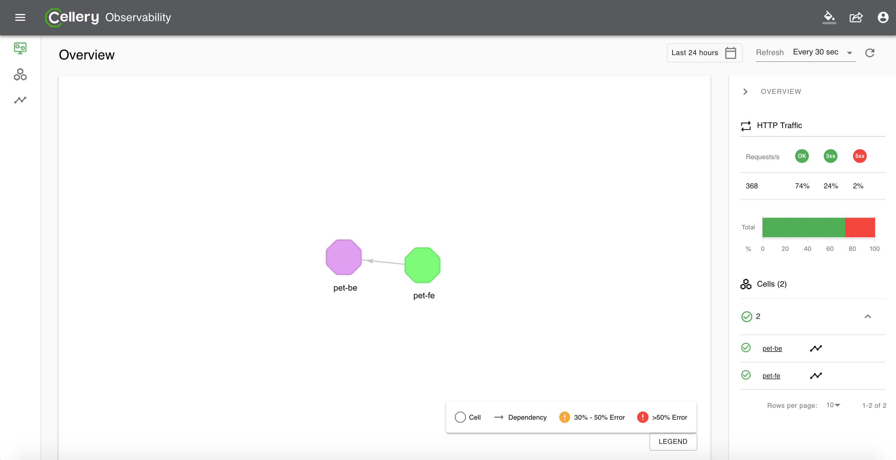
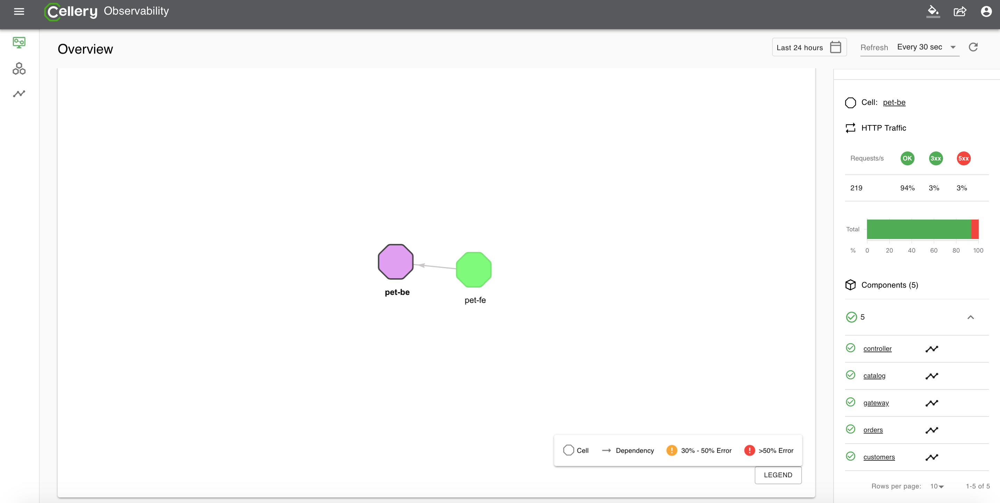
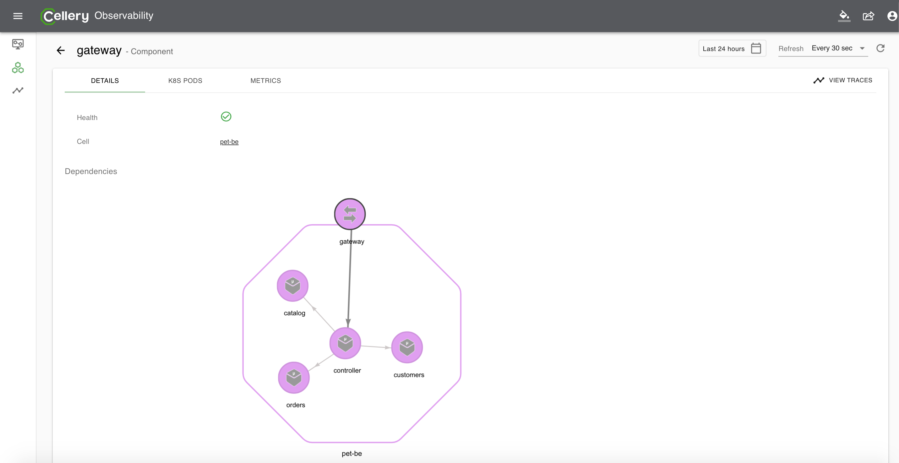

### Cell, Component, Pod, and Node Metrics
The metrics are collected from all components and gateways, and based on this the health of a component and cell is determined. 
The metrics can be visualized both per component and cell basis. Also Cellery provides both kubernetes pod and node level 
metrics (system metrics) which provides CPU, memory, network, and file system usage, and request and response metrics (application metrics).

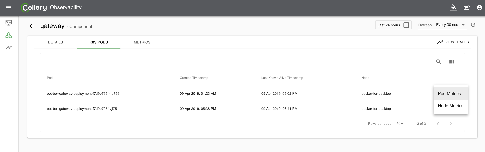
---
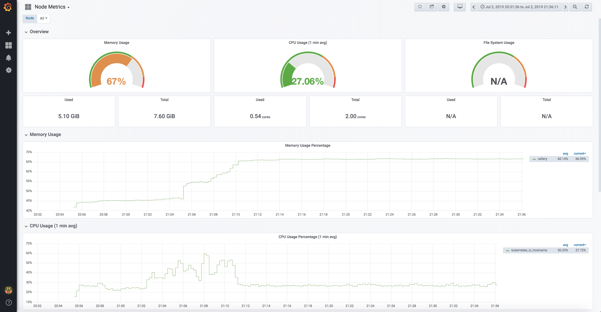
---
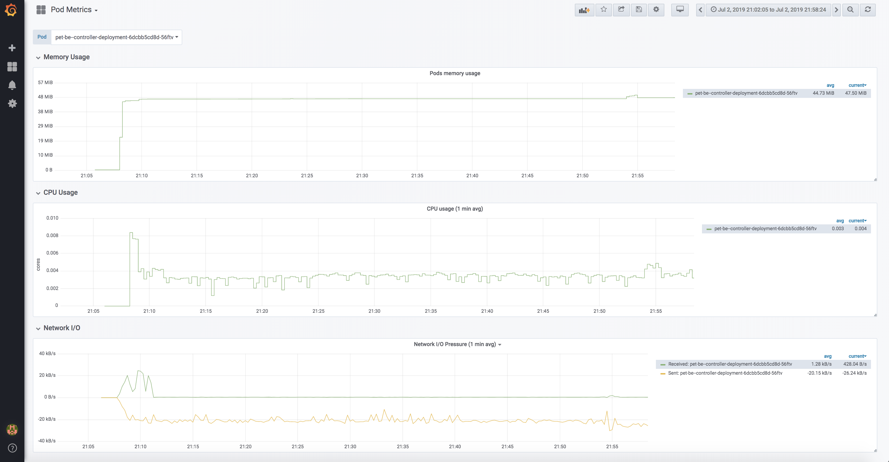
---
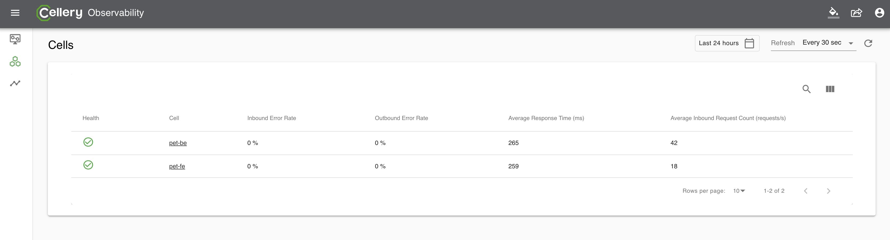
---
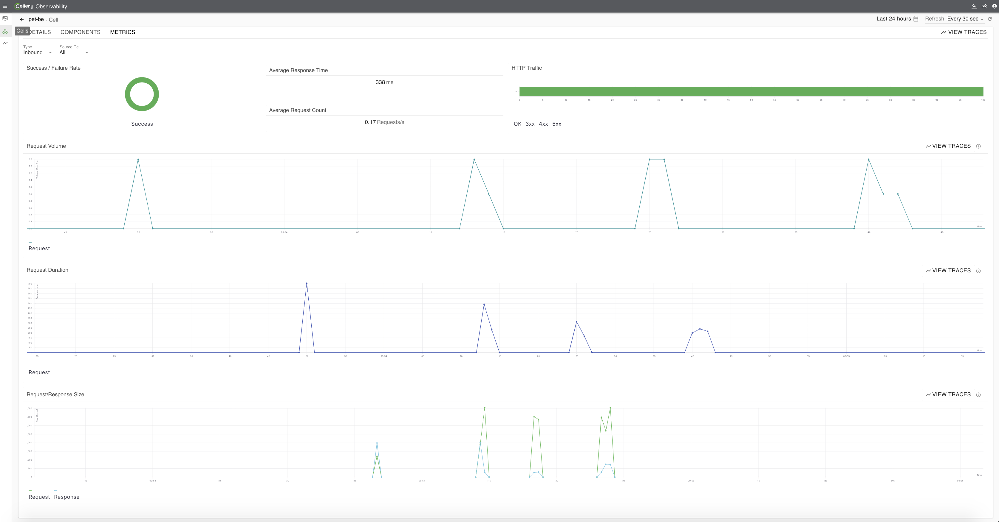
---
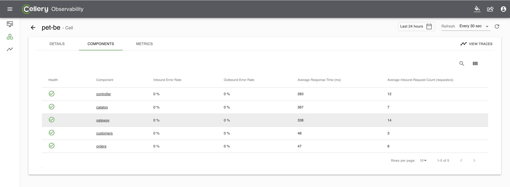
---
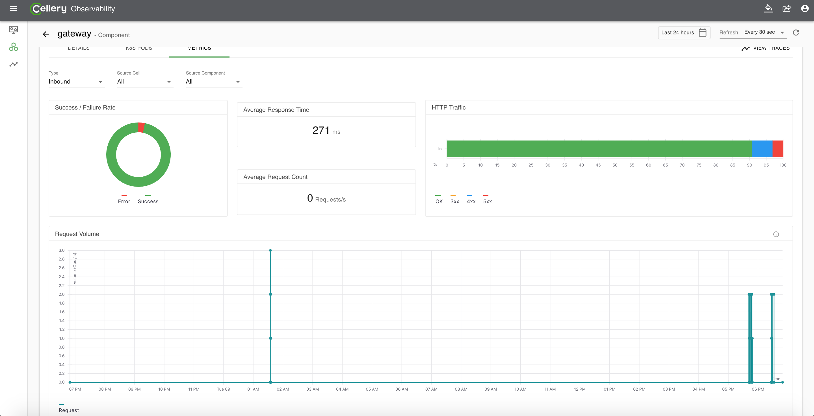

### Distributed Tracing
Each requests that comes into Cellery system is traced, and a request can be viewed in three perspectives; timeline view, sequence diagram view, and dependency diagram view. 
Timeline view mainly focuses on the time that the request spent on a particular operation, and hence it is easy to findout the time consuming component and operation. 
The sequence diagram view depicts the cells and component interactions. Finally the dependency diagram shows the request path. The  trace view can be 
filtered from [metrics view](#cell-component-pod-and-node-metrics), and a seperate distributed tracing search page. 


---
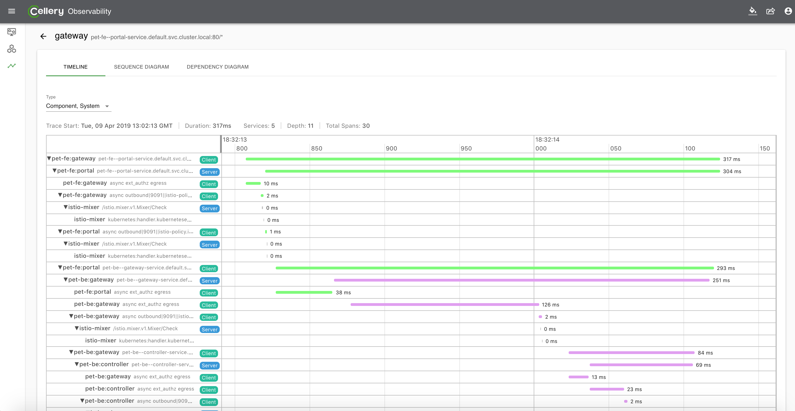
---
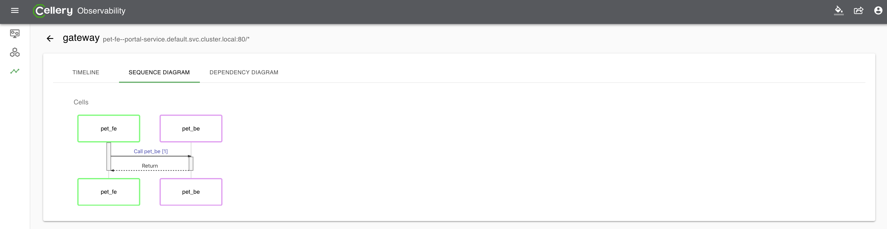
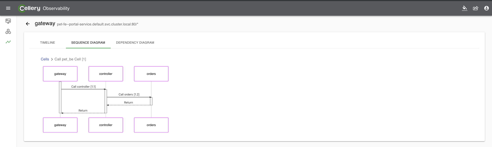
---
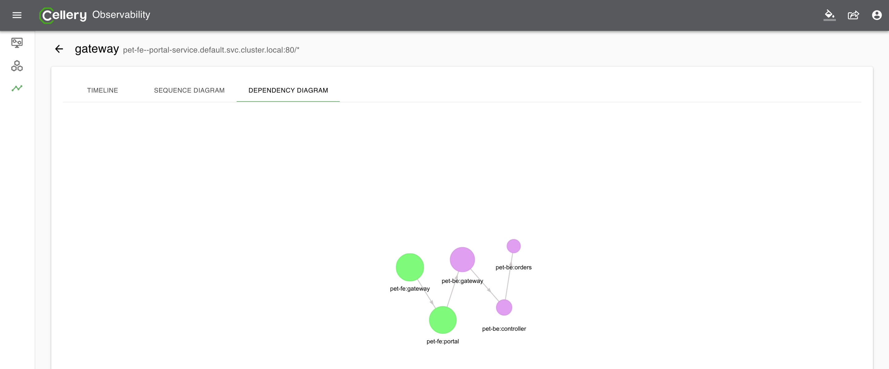

## What's Next?
- [Update](docs/cell-update.md) - update the running cell instance with the new version.
- [Scale up/down](docs/cell-scaling.md) - scalability of running cell instances with zero scaling and horizontal autoscaler.

