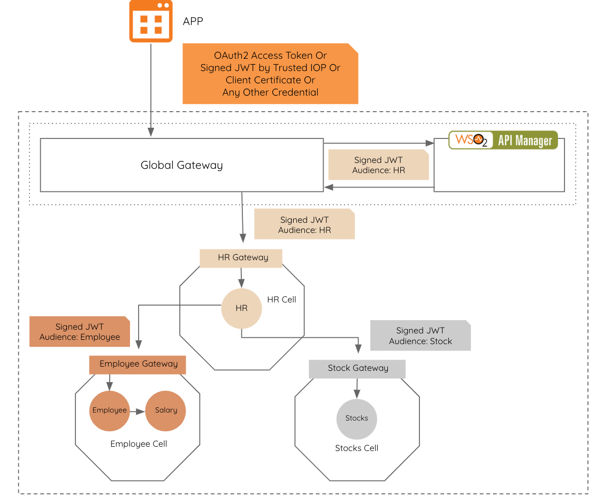

## Employee Portal  
  
Employee Portal sample demonstrates an application which uses the cell-based architecture. This application contains  
four microservices deployed across three different cells based on their responsibilities.   
  
**HR Cell**  
- Contains one microservice written in ballerina.
- This microservice invokes Employee cell and Stock cell to build the employee information and returns the result.
- Exposes an API at the global Gateway which can be consumed by any API consumer from outside Cellery.

**Employee cell**  
- Contains two microservices (employee and salary) written in ballerina.
- Employee microservice returns employee details such as name, designation.
- Salary microservice returns employee salary details.
- Exposes a cell level API, when invoked returns the aggregated response from employee and salary response.

**Stock cell**  
- Contains one microservice written in ballerina.
- This microservice returns the stock related data for the employee.
- Exposes a cell level API, when invoked returns the response from stock microservice.
  

  
  
### Building and Running the sample
1. Git clone the SDK repo, and go into the directory samples/employee-portal/cellery/.
2. Go into the stock directory inside cellery directory, and build the Stocks Cell with `cellery build` command. Then 
run the cell in the cellery mesh by executing `cellery run` command as shown below.
```
$ cellery build stocks.bal -t myorg/stock:1.0.0
Building Stock Cell ...

✔ Building image myorg/stock:1.0.0
✔ Saving new Image to the Local Repository


✔ Successfully built cell image: myorg/stock:1.0.0

What's next?
--------------------------------------------------------
Execute the following command to run the image:
  $ cellery run myorg/stock:1.0.0
--------------------------------------------------------

$ cellery run myorg/stock:1.0.0
Running cell image: myorg/stock:1.0.0
cell.mesh.cellery.io/stock created


✔ Successfully deployed cell image: myorg/helloworld:1.0.0

What's next?
--------------------------------------------------------
Execute the following command to list running cells:
  $ cellery ps
--------------------------------------------------------
```

3. Go into employee directory inside cellery directory, and build th Employee Cell as same as stock cell with below 
mentioned commands.
```
$ cd employee
$ cellery build employee.bal -t myorg/employee:1.0.0
Building Employee Cell ...

✔ Building image myorg/employee:1.0.0
✔ Saving new Image to the Local Repository


✔ Successfully built cell image: myorg/employee:1.0.0

What's next?
--------------------------------------------------------
Execute the following command to run the image:
  $ cellery run myorg/employee:1.0.0
--------------------------------------------------------

$ cellery run myorg/employee:1.0.0
Running cell image: myorg/employee:1.0.0
cell.mesh.cellery.io/employee created


✔ Successfully deployed cell image: myorg/employee:1.0.0

What's next?
--------------------------------------------------------
Execute the following command to list running cells:
  $ cellery ps
--------------------------------------------------------
```

4. The HR cell depends on the stock and employee cell. Therefore, build the HR cell and Then pass -l parameter, which 
specifies the names of the other cells which hr app depends on. Execute the commands provided below to build and runt the HR cells.
```
$ cd hr
$ cellery build hr.bal -t myorg/hr:1.0.0
Building HR Cell ...
Warning: Value is empty for environment variable "employeegw_url"
Warning: Value is empty for environment variable "stockgw_url”
✔ Building image myorg/hr:1.0.0
✔ Removing old Image
✔ Saving new Image to the Local Repository
✔ Successfully built cell image: myorg/hr:1.0.0
What's next?
--------------------------------------------------------
Execute the following command to run the image:
  $ cellery run myorg/hr:1.0.0
--------------------------------------------------------
     2. Execute the following command deploy hr cell. 
$ cellery run myorg/hr:1.0.0  -l employee -l stock
Above commands will deploy the above three cells in the default namespace. To check the cell status run the following command

	$ cellery ps
```
5. Execute `cellery ps` and confirm all cells are in Ready state. 
| NAME  | STATUS | GATEWAY |   SERVICES | AGE |
| ------ | ------  | ------ | ------ | ------ |
| employee | Ready | employee--gateway-service | 3 | 21s |
| hr | Ready | hr--gateway-service | 2 | 21s |
| stock | Ready | stock-options--gateway-service | 2 | 21s |

6. Next to invoke the HR application. Find your external cluster IP and the port by running the following command (Cellery currently uses nginx as the ingress controller),
 ```
 kubectl get svc -n ingress-nginx ingress-nginx
 ```
7. Update the host entries to point the below hosts to the above IP
  <External cluster IP>      wso2-apim-gateway
  <External cluster IP>      wso2-apim
8. Go to API Manager Store (https://wso2-apim:<port>/store) and click Sign Up and register a API 
consumer named alice (i.e Username). Populate the other values accordingly.
9. API in the HR Cell will be exposed via Global API manager. Therefore log into API Manager Store 
(https://wso2-apim:<port>/store) as a Subscriber (i.e admin:admin in a default setup) and subscribe to the API 
named hr_global_1_0_0_info. Get the Consumer Key and Consumer secret of the application used for subscribing.
10. To generate an Access Token, execute the following curl command; Replace the <port> with the value you got from #1 above and <Base64 encoded consumer_key:consumer_secret> with the values you got from #4 above. Replace the password with value provided above.
 curl -k -d "grant_type=password&username=alice&password=<password>" -H "Authorization: Basic <Base64 encoded consumer_key:consumer_secret>" https://wso2-apim-gateway:<port>/token  
To invoke the HR API, execute the following curl command; Replace the <port> with the value you got from #1 above and <Access_Token> with the access token value you got from #5 above.
```
curl -k -H "Authorization: Bearer <Access_Token>" https://wso2-apim-gateway:<port>/hr/hr-api/
```
Sample Response:
```json
{
  "employee": {
    "details": {
      "id": "0410",
      "designation": "Senior Software Engineer",
      "salary": "$1500"
    },
    "stocks": {
      "options": {
        "total": 120,
        "vestedAmount": 105
      }
    }
  }
}
```
11. Deploed cells can be cleaned by below commands
Run following commands to undeploy application.
```
$ cellery stop employee
$ cellery stop stock
$ cellery stop hr
```