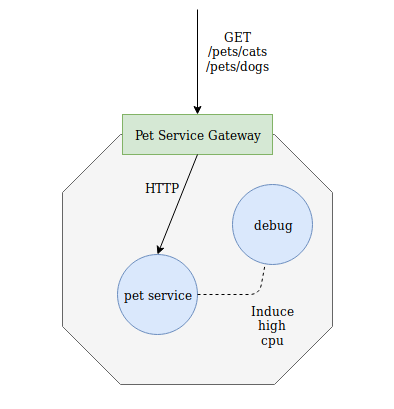

# Cellery Pet Service Sample with Autoscaling

This is a single cell application which demonstrates the autoscaling of cell components. While Cellery is capable of 
using CPU, memory usage, etc. to autoscale cell components, this sample focuses on the former and hence is written to 
artificially hog cpu for demonstration purposes. 

The component interaction diagram of the application is shown below.



## Deploying the sample
1. Run the following command from the `sdk/samples/pet-service` directory:
    ```
    $ cellery build pet-cell.bal -t pet-org/pet-service:1.0.0
    cellery build petCell.bal -t pet-org/pet-service:1.0.0
    Building Pet Service Cell ...
    
    ✔ Building image pet-org/pet-service:1.0.0
    ✔ Saving new Image to the Local Repository
    
    
    ✔ Successfully built cell image: pet-org/pet-service:1.0.0
    
    What's next?
    --------------------------------------------------------
    Execute the following command to run the image:
      $ cellery run pet-org/pet-service:1.0.0
    --------------------------------------------------------
    ```
2. Run the following command to deploy the cell.
    ```
    $ cellery run pet-org/pet-service:1.0.0
    Running cell image: pet-org/pet-service:1.0.0
    cell.mesh.cellery.io/pet-service created
    
    
    ✔ Successfully deployed cell image: pet-org/pet-service:1.0.0
    
    What's next?
    --------------------------------------------------------
    Execute the following command to list running cells:
     $ cellery ps
    --------------------------------------------------------
    ```

3. Wait until Cell gets into ‘Ready’ state. Use the command below to check if the Cell is in Ready state: 
    ```
    $ cellery ps
    NAME          STATUS     GATEWAY                        SERVICES   AGE
    pet-service   NotReady   pet-service--gateway-service   0          1m
    ```

## Invoking the API from the local machine
#### Note: 
By default, the Cellery installation will be using the following domain names,
    ```
    wso2-apim 
    cellery-dashboard 
    wso2sp-observability-api 
    wso2-apim-gateway
    ```
These should be properly mapped to the Kubernetes IngressController IP of the deployment.

1. Login to the API [Store](https://wso2-apim/store/) using admin:admin credentials.

2. Click on ‘pet_service_global_1_0_0_petsvc’ to create a subscription and generate a token. 
(See  [Subscribing to an API](https://docs.wso2.com/display/AM260/Subscribe+to+an+API))

3. Invoke the API using curl

    ```
    curl  https://wso2-apim-gateway/pet-service/petsvc/pets/cats  -H "Authorization: Bearer <access_token>" -k
    ```
    or
    ```    
    curl  https://wso2-apim-gateway/pet-service/petsvc/pets/dogs  -H "Authorization: Bearer <access_token>" -k
    ```

## Simulating high CPU usage

A special debug pod is deployed to induce the effect of high cpu usage.  

1. To simulate high CPU usage, first deploy the debug pod using the command below
   ```bash
    kubectl run debug-tools --image=mirage20/k8s-debug-tools --restart=Never
   ```
 
2. SSH in to the debug pod:
   ```
   kubectl exec -it debug-tools /bin/bash 
   ```
3. Retrieve an access token using the following command:
  ```bash
   curl https://wso2-apim/api/identity/cellery-auth/v1.0/sts/token -v -k  -X POST  \
   --user admin:admin -H "Content-Type: application/x-www-form-urlencoded" \
   -d "subject=alice&scopc=authentication access read write&audience=pet-service"
  ```
   
4. Issue a curl command to the cell gateway to start high cpu usage:
    ```bash
      curl pet-service--gateway-service/petsvc/cpuhogger/start -v -H "Authorization: Bearer <access_token>"
    ```
   
   This will start a CPU intensive operation in the pet-service component. As a result of this, the pet-service pod 
   count will get increased. This can be noted by listing the pods in the default namespace, with the following command:
   ```
   kubectl get pods
   ```
   
5. After testing the pet-service as explained in the previous section, to stop the CPU intensive operation, issue the 
following command from the debug pod: 
   ```
   curl pet-service--gateway-service/petsvc/cpuhogger/stop
   ```
   
   This will result in the number of pods which belongs to the pet-store service being reduced to one gradually.  
   
   
## Cleaning up
Issue the following commands to delete the pet-service sample and the debug pod:
    
```
$ cellery stop pet-service
cell.mesh.cellery.io "pet-service" deleted 
```    
```bash
$ kubectl delete pod debug-tools
pod "debug-tools" deleted
```